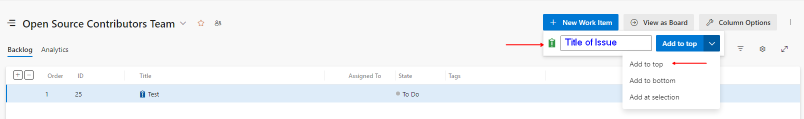
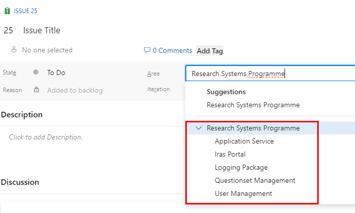
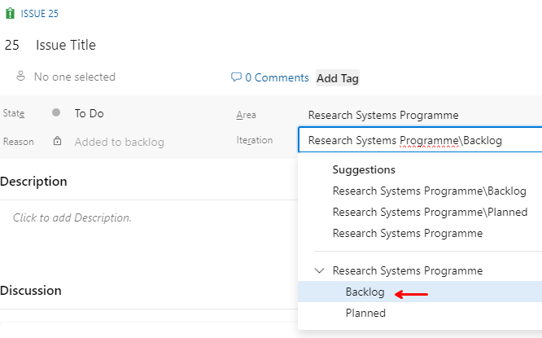

# Contributing guidelines <!-- omit in toc -->

Thank you for investing your time in contributing to our project. Read our [Code of Conduct](https://dev.azure.com/FutureIRAS/Research%20Systems%20Programme/_wiki/wikis/RSP.wiki/81/Code-of-Conduct) to keep our community approachable and respectable.

In this guide you will get an overview of the contribution workflow from requesting access, opening an issue, creating a PR, reviewing, and merging the PR.

- [New contributor guide](#new-contributor-guide)
- [Getting started](#getting-started)
  - [Contribution Guidelines](#contribution-guidelines)
- [Start Contributing](#start-contributing)
  - [Create a new issue](#create-a-new-issue)
  - [Solve an issue](#solve-an-issue)
  - [Pull Request](#pull-request)
  - [Your PR is merged!](#your-pr-is-merged)
- [Support](#support)

# New contributor guide

To get an overview of the project, and how to set up locally, read the [README](README.md) file.

If you are new to Git and/or Azure DevOps, here are some resources to help you get started with Azure DevOps git repositories:

- [Azure Git Repos](https://learn.microsoft.com/en-us/azure/devops/repos/git/?view=azure-devops)
  - [Git command reference](https://learn.microsoft.com/en-us/azure/devops/repos/git/command-prompt?view=azure-devops)
- [Set up Git](https://learn.microsoft.com/en-us/devops/develop/git/install-and-set-up-git)
- [GitHub flow](https://docs.github.com/en/get-started/using-github/github-flow)
- [Collaborating with pull requests](https://learn.microsoft.com/en-us/azure/devops/repos/git/pull-requests?view=azure-devops&tabs=browser)
- [Video - PR in Azure DevOps](https://learn.microsoft.com/en-us/shows/visual-studio-toolbox/pull-requests-in-azure-devops)

# Getting started

## Contribution Guidelines

Before you start contributing, please take a moment to:

1. Read the [Governance Model](https://dev.azure.com/FutureIRAS/Research%20Systems%20Programme/_wiki/wikis/RSP.wiki/88/Governance-Model) to understand:
   1. **Roles and Responsibilities**: Understand the roles of maintainers, reviewers, and contributors.
   2. **Decision-Making Process**: Learn how decisions are made, including the criteria for accepting contributions.
   3. **Escalation Pathways**: Know how to raise concerns or propose changes to the guidelines or project direction.

2. Familiarize yourself with the [Contribution Guidelines](https://dev.azure.com/FutureIRAS/Research%20Systems%20Programme/_wiki/wikis/RSP.wiki/83/Contribution-Guidelines) outlined on the Wiki. These guidelines provide an overview of how to get started, including the steps for requesting contributor access and understanding the permissions granted upon approval.

# Start Contributing

After receiving approval, you can start contributing in the following ways:

## Create a new issue

If you spot a problem, [search if an issue already exists](https://dev.azure.com/FutureIRAS/Research%20Systems%20Programme/_backlogs/backlog/Open%20Source%20Contributors%20Team/Issues). If a related issue doesn't exist, you can [create a new issue](https://dev.azure.com/FutureIRAS/Research%20Systems%20Programme/_backlogs/backlog/Open%20Source%20Contributors%20Team/Issues) in the backlog. To create a new issue follow the steps below:

1. On the backlog page, click on `New Work Item` button. Provide a title for the issue and click `Add To Top`. If `Add to Top` option is not visible select from the drop down

    

2. Click on the newly created issue and add more details under description.
3. Select the area and iteration relevant to the repository e.g.
   1. For this repository i.e. `rsp-usermanagement-service`, the area should be `User Management`.
   2. The iteration should always be set to `Research System Programme\Backlog`, only **Maintainers** and **Project Leads** cna change the iteration.

    - Area 

    - Iteration 

4. The issue will be picked up in planning, and will be triaged
5. You can start the discussion using the **Discussion** section under the issue.
6. The updates will be provided under the Discussion section

## Solve an issue

Scan through our [existing issues](https://dev.azure.com/FutureIRAS/Research%20Systems%20Programme/_backlogs/backlog/Open%20Source%20Contributors%20Team/Issues) to find one that interests you. You can narrow down the search using filters. As a general rule, we don’t assign issues to anyone. If you find an issue to work on, you are welcome to assign it to yourself, and open a PR with a fix.

Follow these steps to get started

1. **Fork the repository**: Create a copy of the repository to work on independently.
   
   - [How to fork](https://learn.microsoft.com/en-us/azure/devops/repos/git/forks?view=azure-devops&tabs=visual-studio#create-a-fork)
 
2. **Clone the repository**: Use the command below to clone the repository to your local machine:

   ```bash
   git clone https://FutureIRAS@dev.azure.com/FutureIRAS/Research%20Systems%20Programme/_git/rsp-usermanagement-service
   ```

3. **Create a branch**: Use a descriptive name for your branch: As a general rule, use the format [issue number]-[issue-description]. An issue description should be a couple of words, separated by hyphen.

   ```bash
   git checkout -b <branch-name>
   ```

4. **Make your changes**: Implement your fixes, improvements, or new features.

5. **Test your changes**: Ensure your modifications are functional and do not break existing features.

6. **Write Unit/Integration Tests**: Your fix should be supported by unit tests and integration tests if necessary. Please check how the existing tests are implemented and follow the same pattern.

7. **Commit your changes**: Before you commit your changes, please read the general [Commit Verification Checklist](https://dev.azure.com/FutureIRAS/Research%20Systems%20Programme/_wiki/wikis/RSP.wiki/86/Commit-Verification-Checklist).
   
   Use the following command to commit
   
   ```bash
   # at the root of the project type
   git add .
   
   # followed by
   git commit
   ```
    One the editor is open for adding a message use clear and concise commit messages in the following format. We use [Semantic Versioning](https://semver.org/#semantic-versioning-200) to increment the version. Please use the following keywords in the commit message for automatic versioning. 

    - `+semver:breaking` for major version update e.g. **1**.0.0
    - `1+semver:feature` for minor version update e.g. 0.**1**.0
    - `+semver:fix` for revision/patch version update e.g. 0.0.**1**

    ```bash
    +semver:feature [Issue Number]: [Issue Description]
    - Details of changes 1
    - Details of changes 2
      - Sub details 1
      - Sub details 2
    ```
8.  **Push your changes**: Upload your branch to the repository:

      ```bash
      git push origin <branch-name>
      ```
9.  **Create a pull request**: When you're finished with the changes, create a pull request, also known as a PR. Follow the steps below for creating a PR.

## Pull Request

Navigate to the repository in Azure DevOps and submit a pull request for review.

- Fill the in the template so that we can review your PR. This template helps reviewers understand your changes as well as the purpose of your pull request.

- Don't forget to [link PR to issue](https://learn.microsoft.com/en-us/azure/devops/boards/backlogs/add-link?view=azure-devops#link-work-items-to-pull-requests) if you are solving one.

- Once you submit your PR, a team member will review your proposal. We may ask questions or request additional information via PR comments.

- We may ask for changes to be made before a PR can be merged, either using [suggested changes](https://devblogs.microsoft.com/devops/introducing-the-new-pull-request-experience-for-azure-repos/) or pull request comments. You can apply suggested changes directly through the UI or you can make the suggested or any other changes in your fork, then commit them to your branch.
- As you update your PR and apply changes, mark each conversation as [Resolved](https://learn.microsoft.com/en-us/azure/devops/repos/git/review-pull-requests?view=azure-devops&tabs=browser#reply-to-comments).
- If you run into any merge issues, checkout this [tutorial](https://learn.microsoft.com/en-us/azure/devops/repos/git/merging?view=azure-devops&tabs=visual-studio-2022&preserve-view=true) to help you resolve merge conflicts and other issues.

## Your PR is merged!

Congratulations. The HRA team thanks you.

Once your PR is merged, your contributions will be acknowledged in release notes.

# Support

For further assistance, please contact us at **[contribute@hra.nhs.uk](mailto:contribute@hra.nhs.uk)**.